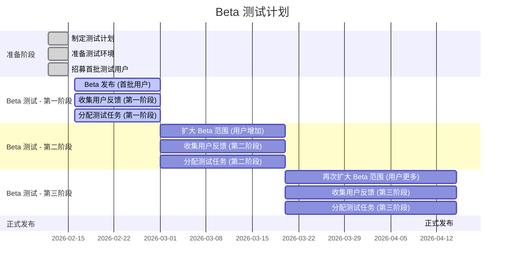

```mermaid
gantt
    title Beta 测试计划
    dateFormat  YYYY-MM-DD
    section 准备阶段
    制定测试计划 :done,    2026-02-12, 2026-02-15
    准备测试环境 :done,    2026-02-12, 2026-02-15
    招募首批测试用户 :done,    2026-02-12, 2026-02-15
    section Beta 测试 - 第一阶段
    Beta 发布 (首批用户) :active, 2026-02-16, 2026-03-01
    收集用户反馈 (第一阶段) :active, 2026-02-16, 2026-03-01
    分配测试任务 (第一阶段) :active, 2026-02-16, 2026-03-01
    section Beta 测试 - 第二阶段
    扩大 Beta 范围 (用户增加) : 2026-03-01, 2026-03-20
    收集用户反馈 (第二阶段) : 2026-03-01, 2026-03-20
    分配测试任务 (第二阶段) : 2026-03-01, 2026-03-20
    section Beta 测试 - 第三阶段
    再次扩大 Beta 范围 (用户更多) : 2026-03-20, 2026-04-15
    收集用户反馈 (第三阶段) : 2026-03-20, 2026-04-15
    分配测试任务 (第三阶段) : 2026-03-20, 2026-04-15
    section 正式发布
    正式发布 : 2026-04-15, 2026-04-15

```